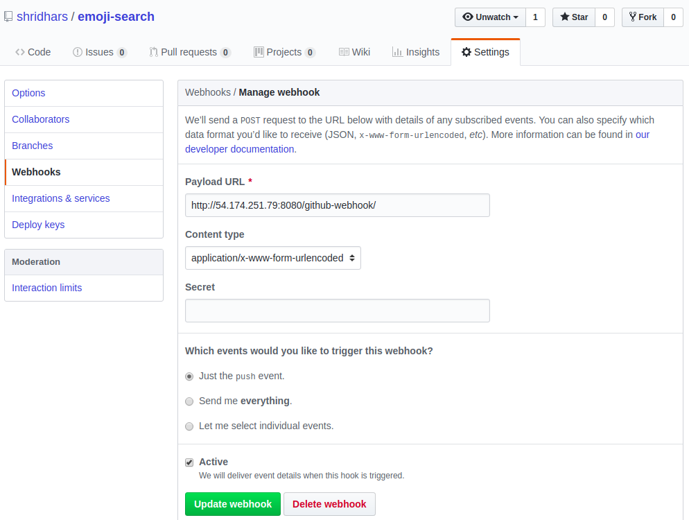

## Continuous Integration setup for React Application emoji-search

This setup will help you configure ci process for react applications.
The repository ahfarmer/emoji-seach has been downloaded(or can be forked) on local machine and pushed to [shridhars/emoji-search](https://github.com/shridhars/emoji-search) on github.

All the autmation scripts are available under shridhars/emoji-search/automation folder

### Configured Jenkins Server using cloudformation template.
**Steps:** 

* Upload cloudformation template in the repository path [automation/cfn-ec2-with-security-group.yaml](cfn-ec2-with-security-group.yaml) to AWS cloudformation create stack console to create a server and software instllation including jenkins application through userdata parameter in EC2

* Jenkins username and password separately sent in email

* Manually Setting up jenkins login and plugins. Following plugins have been installed
    * Dry - for Copy paste detection or duplicate code analysis
    * Clover - For Test Coverage
    * Checkstyle - for Code errors and Warnings
    * Static Analysis collector - for showing the build trend for the above used tools
    * Blue Ocean - Provides better UI and visualization of Pipeline.
    * Slack Notification - To notify build status on Slack Chat Application.
      Enable the Jenkins app in slack which provides webhook and token to intract with a slack channel. This webhook and token has to be updated in the "System configuration" on Jenkins 
    * GithubNotify - To indicate build status of a commit hash on Github
    * Junit - Record unit/component test results
    * Role-based Authorization Strategy Plugin
    * CloudBees Docker Build and Publish - To build and publish docker containers
    * S3 Publisher Plugin - To upload artifacts on S3 if required.
* Configured jenkins global credentials to be used with jobs.
  The credentials can be viewed on http://54.174.251.79:8080/credentials/ and are configured with following IDS
  * gitaccesstoken: to interact securely with github using github access tokens
  * slacknotifytoken: to interact securely with slack channel
  * dockerhub: docker hub user name and password to push images to dockerhub

* Setup a local image on the jenkins server with tag shridharalve/node:reactapp-img using Dockerfile in [automation/Dockerfile](Dockerfile). Jenkins will use this image to provision containers to run builds.

### Configure Jenkins pipeline

The Jenkins pipeline is configured using [Jenkinsfile](../Jenkinsfile) included in the repository.

It includes the following stages:

* Prepare

  Setup docker agent.
  Notify pending state to github sha pushed to the repository

* Build
  run npm install to install required application packages
  install CI tools elinst and jscpd for static analysis. Below snippet is included in [Jenkinsfile](../Jenkinsfile) for the buld step 
  
  ```sh
  sh 'npm install'
  sh 'npm install jscpd --save-dev'
  sh 'npm install eslint --save-dev'
  sh 'npm install eslint-plugin-react --save-dev'
  sh 'npm install babel-eslint --save-dev' 

  ```sh

* Static Analysis
  
  Perform static analysis and collect result using checkstyle and dry plugins. Below commands in [Jenkinsfile](../Jenkinsfile) are used to run static analysis
  
  ```sh
  sh 'node_modules/eslint/bin/eslint.js --ext .js -f checkstyle -o linttext.xml src/'
            
  checkstyle canComputeNew: false, canRunOnFailed: true, defaultEncoding: '', healthy: '', pattern: 'linttext.xml', unHealthy: ''

  sh 'node_modules/jscpd/bin/jscpd'

  dry canComputeNew: false, canRunOnFailed: true, defaultEncoding: '', healthy: '', pattern: 'jscpd.xml', unHealthy: ''
  
  ```sh

* Test

  Run npm test and collect unit/component testing coverage report

* Pull to test server
  If the build has passed and commit message has substring "[ci pull-test]" pull code to test servers for manual testing.

* Package for production
  Changes merged or pushed on master branch are baked in a docker container and pushed to docker hub registry. Snippet for packaging step in [Jenkinsfile](../Jenkinsfile)

  Alternative process would be just bulding the application in docker and push minified js and css files to s3 and served using cloudfront. The new manifest file should be synced across all servers as a deployment step for the newly compiled js and css files.

  ```sh
  sh 'echo Call script to deploy container on production or just build pull code and perform blue green deployment with aws instances'

  sh """
    git clone https://github.com/shridhars/emoji-search.git emoji-search
  """

  //building docker image with latest code
  sh """
    docker build -t shridharalve/node:reactapp-"${env.BUILD_NUMBER}" -f emoji-search/automation/Dockerfile-production .
  """        

  sh """
    docker login -u="${env.DOCKER_REG_CREDS_USR}" -p="${env.DOCKER_REG_CREDS_PSW}"
  """

  //pushing docker image to dockerhub
  sh """
    docker push shridharalve/node:reactapp-"${env.BUILD_NUMBER}"        
  """
  slackSend color: "good", message: "@here Code has been packaged into the container image with name react-app:${env.BUILD_NUMBER} and pushed to registry" 

  ```sh

* Pipline configured under reactapp-ci and reactapp-ci-multibranch incase we need to run different pipeline for each feature branch.

* Jenkins login to check the pipeline sent in email seperately
  

### Setup github webhooks

  Github webhooks have been setup, so that on every push to the repository shridhars/emoji-search the jekins pipline is triggered to run ci for the git branch

  

### Setup docker hub registry to publish production ready build images.

* These images contain the master code for the latest github merge or master push.
  If the master branch is updated the reactapp-ci build installs the necessary software and 
  These production ready build images can be provisioned on EC2 instances for deployment. 
  Images are stored and versioned according to the build no.
  eg. a 3rd jenkins build will have number  shridharalve/node:reactapp-3

  Check Tags under [shridharalve/node](https://hub.docker.com/r/shridharalve/node/tags/) for images built using pipeline

  Alternatively a database could be maintained to track deployments and release versions.
  Using the database table the docker image versions can be tagged serially as per the number of deployments tracked in the database.

### Git post-commit hook

* The git post commit hook can be added to local copy of git repository to run build on every commit and deploy it to the docker container. Copy the below code in .git/hooks/post-commit of your repository

```sh
#!/bin/bash

#post commit hook to build application on every commit

if [[ $(docker ps -a --filter "name=reactapp" --format "{{.Names}}" | wc -l) > 0 ]];then
  if [[ $(docker ps --filter "name=reactapp" --format "{{.Names}}" | wc -l) == 0 ]];then  
    docker start reactapp   
  fi  
else  
  if [[ $(docker images --format "{{.Repository}}" | grep "reactapp-img" | wc -l) == 0 ]];then
    docker build -t shridharalve/node:reactapp-img -f "$(git rev-parse --show-toplevel)"/automation/Dockerfile .
  fi
  docker run -d -v /var/www/emoji-search:/var/www/emoji-search --name reactapp shridharalve/node:reactapp-img  
fi

docker exec -d reactapp bash -c "cd /var/www/emoji-search/ && npm install --unsafe && npm run build  && npm run build && PORT=80 npm start > ~/app.log 2>&1 &"
```sh


